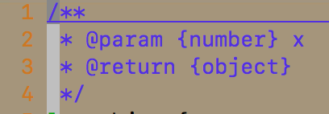

# vim-javascript

对于前端开发同学推荐在自己的 vim 上添加 [vim-javascript](https://github.com/pangloss/vim-javascript) 插件。该插件主要提供了语法高亮和增强版本的缩进功能。

## 安装

推荐使用插件管理器 [vim](https://www.vim.org) 来管理安装该插件，详细使用方式请参阅 [vim-plugin](./vim-plugin.md)。

## 语法高亮

Vim 编辑器内置支持基础的 JavaScript 语法高亮，而 vim-javascript 提供了增强版本的 JavaScript 语法高亮。

### JSDocs 语法高亮

[JSDocs](http://usejsdoc.org/) 是一个 JavaScript 注释规范，同时也是一个可以生成网页文档的 CLI。对于在 JavaScript 代码中的 JSDocs 注释，Vim 没有提供注释高亮功能，只会当成普通的注释文本；而添加了 vim-javascript 插件后，可以通过在 `.vimrc` 配置文件中配置如下信息使 Vim 支持 JSDocs 注释高亮：

```vim
let g:javascript_plugin_jsdoc = 1
```

该配置默认关闭，默认值为 0。

开启前：



开启后：


### NGDocs 语法高亮

同 [JSDocs](http://usejsdoc.org/)，是另外一个 JavaScript 注释规范，开启注释高亮的配置如下：

```vim
let g:javascript_plugin_ngdoc = 1
```

该配置默认关闭，默认值为 0。

### flow 语法高亮

flow 是一款静态类型检测软件，主要用于在写代码时对 JavaScript 代码进行静态类型检测，开启注释高亮的配置如下：

```vim
let g:javascript_plugin_flow = 1
```

## 自动折叠

vim-javascript 提供了自动折叠功能，开启方式如下：

```vim
augroup javascript_folding
    au!
    au FileType javascript setlocal foldmethod=syntax
augroup END
```
该功能只是基于语法来折叠代码，并且会有性能问题，所以不建议开启该功能。折叠建议使用 Vim 自带的折叠功能。

## 隐藏关键字

vim-javascript 插件允许使用象形的字符来表示一些关键字，例如，使用 `@` 表示关键字 `this` 等。映射列表如下：

```vim
let g:javascript_conceal_function             = "ƒ"
let g:javascript_conceal_null                 = "ø"
let g:javascript_conceal_this                 = "@"
let g:javascript_conceal_return               = "⇚"
let g:javascript_conceal_undefined            = "¿"
let g:javascript_conceal_NaN                  = "ℕ"
let g:javascript_conceal_prototype            = "¶"
let g:javascript_conceal_static               = "•"
let g:javascript_conceal_super                = "Ω"
let g:javascript_conceal_arrow_function       = "⇒"
let g:javascript_conceal_noarg_arrow_function = "🞅"
let g:javascript_conceal_underscore_arrow_function = "🞅"
```

上面的象形字符可以自定义。开启该功能需要在 `.vimrc` 文件中添加下面这行配置：

```vim
set conceallevel=1
```

同时，该插件也允许在打开文件的同时切换是否使用隐藏关键字这个功能，官方的切换配置如下：

```vim
map <leader>l :exec &conceallevel ? "set conceallevel=0" : "set conceallevel=1"<CR>
```

**注：leader 一般是按键 `\`，而`\``l` 这两个键组合时按起来不方便，建议修改为其他组合。**

修改 `leader` 键的方式如下：

```vim
let mapleader=','
```

## 缩进

## Author Info 🐴

* [GitHub](https://github.com/Tao-Quixote)
* e-mail：<web.taox@gmail.com>