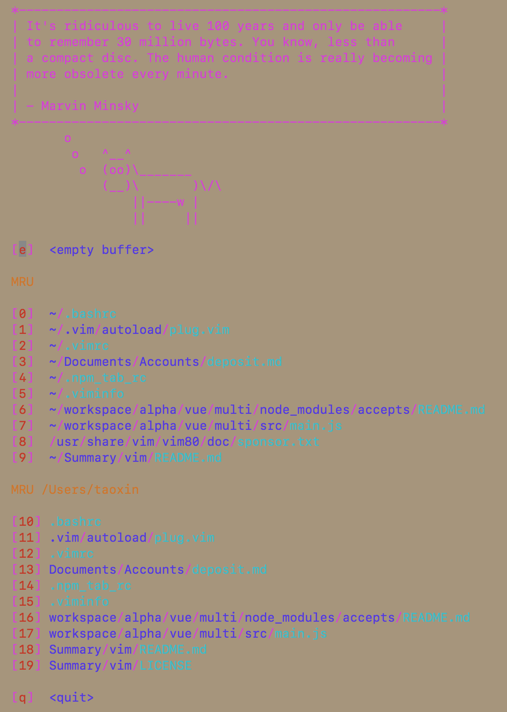

# vim-startify

**vim-startify** 插件用来给 vim 编辑器提供一个启动界面。当直接在终端中使用 `vim` 或者其他 alias 启动 vim，但没有提供要打开的文件名字时会出现该启动界面。

## 安装

我们使用 [vim-plugin](https://github.com/junegunn/vim-plug) 来安装该插件。

在 vim-plugin 的配置信息块中，加入：

```vim
Plug 'mhinz/vim-startify'
```

示例：

```vim
call plug#begin('~/.vim/plugged')
... "其他插件
Plug 'mhinz/vim-startify'
... " 其他插件
call plug#end()
```
加入上面的配置信息后，在命令模式下输入 `:PlugInstall [name]` 来安装 vim-startify 插件。

PS：插件管理器的使用参见 [vim-plugin](./vim-plugin.md)。

## 截图



如上图所示，启动界面展示了 20 个最近打开过的文件的文件路径，可以通过文件路径前的序号打开对应的文件。

## 查看帮助信息

vim-startify 提供了两个帮助命令：

* :h startify - 可用来查看所有文档信息
* :h startify-faq - 可用来查看 FAQ 文档

## 低版本 MacVim 打开文件只读的问题

Mac 上使用的不是单纯的 vim，而是 [MacVim](http://macvim-dev.github.io/macvim/)。在使用 vim-startify 时，如果 MacVim 的版本比较老，文件会以只读的模式打开。这个问题的解决办法就是安装一个新的 MacVim，因为 vim-startify 不能解决这个问题，而老版本的 MacVim 也不可能解决这个问题。

这里我们不推荐使用新安装的 MacVim 替换系统自带的 MacVim，所以我自己使用 `alias` 重定义了 `vim` 的指向：

```bashrc
// ~/.bashrc
alias vim='/Applications/MacVim.app/Contents/bin/vim'
alias vi='vim'
alias v='vim'
```
这里在 `~/.bashrc` 文件中通过 `alias` 命令重新定义了 `vim` 的指向，使其指向新安装的 MacVim；然后又定义了两个别名，使 `vi` 和 `v` 也指向新安装的 MacVim。

下载地址：[MacVim](https://github.com/macvim-dev/macvim)。

## Author Info 🐗

* [GitHub](https://github.com/Tao-Quixote)
* e-mail：<web.taox@gmail.com>