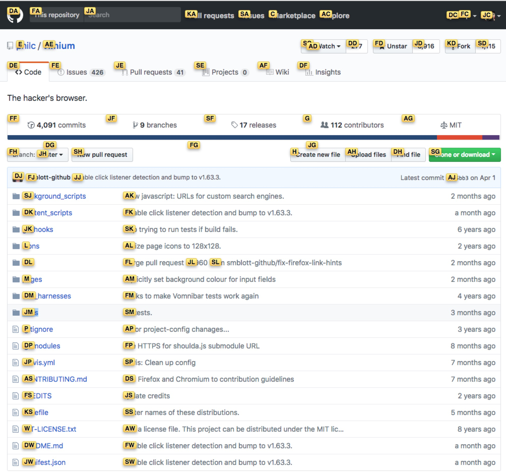
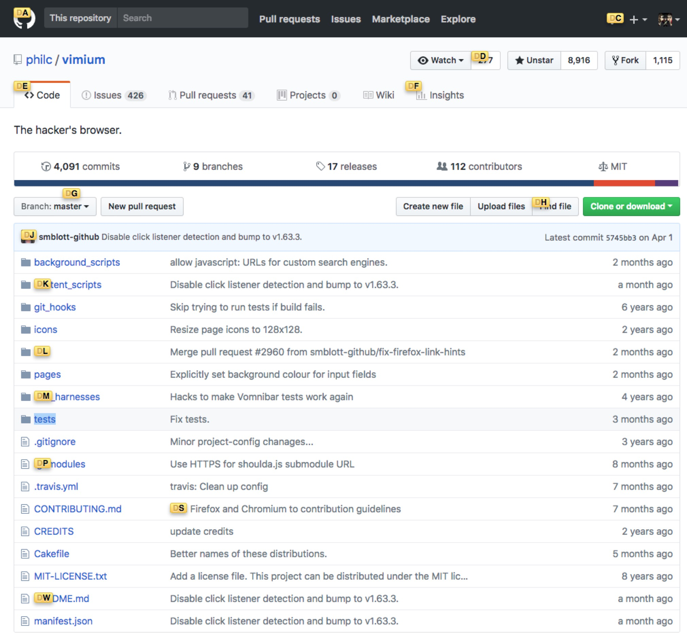
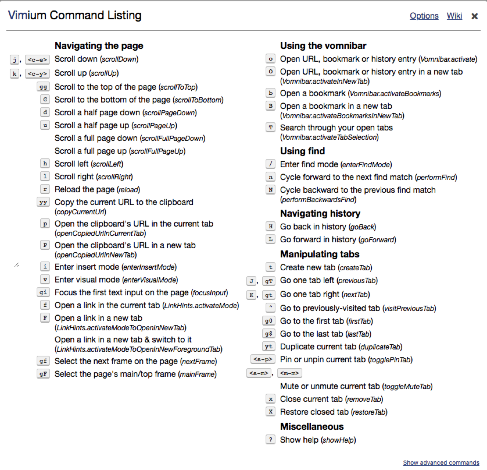

# vimium

最近准备使用 [vim](https://github.com/vim/vim) 作为开发工具，于是在学习怎样提高 vi 生产力。在学习插件的过程中先发现一个 Chrome 插件 **vimium**，在安装后可以使用户在 Chrome 浏览器中使用 vi 编辑器中的快捷键。试用之后，惊为天人，因此安利给大家。

该插件对 vim 中常用的快捷键在浏览器中进行了相似的映射，因此对于熟悉 vim 操作的小伙伴来说，该插件还是非常容易上手的。

**注：快捷键区分大小写。**

## 下载安装地址

先上安装地址：

* Google Chrome Web Store - [Vimium - Chrome Web Store](https://chrome.google.com/webstore/detail/vimium/dbepggeogbaibhgnhhndojpepiihcmeb)
* GitHub - [philc/vimium](https://github.com/philc/vimium)

## 快捷键

快捷键及其描述比较简单，不做过多的翻译。只对其中有歧义的地方进行描述。

### 当前页面导航

```vim
?       show the help dialog for a list of all available keys
h       scroll left
j       scroll down
k       scroll up
l       scroll right
gg      scroll to top of the page
G       scroll to bottom of the page
d       scroll down half a page
u       scroll up half a page
f       open a link in the current tab
F       open a link in a new tab
r       reload
gs      view source - 展示的 vimium 的源码，而不是当前页面的源码
i       enter insert mode -- all commands will be ignored until you hit Esc to exit
yy      copy the current url to the clipboard
yf      copy a link url to the clipboard
gf      cycle forward to the next frame
gF      focus the main/top frame
```

这里基本都是基本操作，只要牢记 `?` 可以唤出所有可用快捷键的帮助信息就好了。

**`f/F`** 这个快捷键值得注意一下。该快捷键会将当前页面上所有的跳转链接用不同的字母组合标示出来，如下图：



选择 `a` 开头的链接：



如果选择错了，可以通过 `delete` 键进行修改。

### 打开新页面

可以在书签中进行搜索真的太方便了。

```vim
o       Open URL, bookmark, or history entry
O       Open URL, bookmark, history entry in a new tab
b       Open bookmark
B       Open bookmark in a new tab
```
注意点：

* 小写都是在当前页面打开，大写都是在新的 tab 打开
* b/B 只在保存的书签中进行查找，而 o/O 可以打开 URL、书签以及历史访问的 URL

### 查找

```vim
/       enter find mode
          -- type your search query and hit enter to search, or Esc to cancel
n       cycle forward to the next find match
N       cycle backward to the previous find match
```

**注：按 `/` 进入查找后，需要按 回车键 之后才能使用 `n/N` 快捷键，否则会继续输入。**

### history

相当于浏览器的前进/后退功能。

```vim
H       go back in history
L       go forward in history
```

### 操作 tab

```vim
J, gT   go one tab left
K, gt   go one tab right
g0      go to the first tab
g$      go to the last tab
^       visit the previously-visited tab
t       create tab
yt      duplicate current tab
x       close current tab
X       restore closed tab (i.e. unwind the 'x' command)
T       search through your open tabs
W       move current tab to new window
<a-p>   pin/unpin current tab
```

#### 切换 tab

左右切换 tab 这个功能特别实用，但是，vimium 在一些特定的页面中是无法使用的。所以，当我们切换到一个无法使用 vimium 的页面时，所有关于切换 tab 的快捷键都不能用了。这时可以使用 Chrome 切换 tab 的快捷键切换到允许使用 vimium 插件的页面，然后再使用 vimium 的切换 tab 功能。

* Mac - Command + shift + {：向左切换 tab
* Mac - Command + shift + }：向右切换 tab
* Windows - Ctrl + tab：向右切换 tab
* Windows - Ctrl + shift + tab：向左切换 tab

#### 关闭/重新打开 tab

在 Mac 上，可以通过 `Command + w` 来关闭 tab；安装了 vimium 后可以通过 `x` 来关闭 tab；而且，有时我们手速太快误关了一个 tab 之后，可以通过 `X` 重新打开刚关闭的页面。

<small>Chrome 自己有一个快捷键来重新打开刚关闭的 tab，但是由于太长了，一直没记住。（捂脸，逃</small>

### 其他高级命令

```vim
]], [[  Follow the link labeled 'next' or '>' ('previous' or '<')
          - helpful for browsing paginated sites
<a-f>   open multiple links in a new tab
gi      focus the first (or n-th) text input box on the page
gu      go up one level in the URL hierarchy
gU      go up to root of the URL hierarchy
ge      edit the current URL
gE      edit the current URL and open in a new tab
zH      scroll all the way left
zL      scroll all the way right
v       enter visual mode; use p/P to paste-and-go, use y to yank
V       enter visual line mode
```

## 修改快捷键映射

### 普通字符配置

正常的字符键可以直接写其对应的字符，如配置字符 `j` 为向下滚动页面：

```vimium
map j scrollDown
```

其中 `map` 为 vimium 的关键字；`j` 为要映射的字符按键；`scrollDown` 为 vimium 中指定向下滚动页面的指令。

vimium 中各种动作的指令名称如下：



在安装了 vimium 的浏览器中，可以通过快捷键 `?` 来查看各个快捷键对应的指令；也可以通过帮助信息 dialog 最上面的 **Options** 选项来查看指令名称。

### 特殊字符配置

而特殊按键的映射配置遵循一下原则：

* \<c-\*>, \<a-\*>, \<m-\*> for ctrl, alt, and meta (command on Mac) respectively with any key. Replace * with the key of choice.
* \<left>, \<right>, \<up>, \<down> for the arrow keys.
* \<f1> through \<f12> for the function keys.
* \<space> for the space key.
* \<tab>, \<enter>, \<delete>, \<backspace>, \<insert>, \<home> and \<end> for the corresponding non-printable keys (version 1.62 onwards).

例如，在 Mac 机器上，如果要配置 `Command + m` 为静音的快捷键，则应该使用下面的方式：

```vimium
map <m-m> toggleMuteTab
```

其对应关系如下：

`<``m``-``m``>``toggleMuteTab`</br>
`<``Command``-``m``>``切换当前 tab 是否静音`

## Mmmm...

基本命令及设置就讲这么多，更高级的用法可以查看 [README](https://github.com/philc/vimium#vimium---the-hackers-browser)。

## Author 🦉

* [GitHub](https://github.com/Tao-Quixote)
* e-mail: <web.taox@gmail.com>